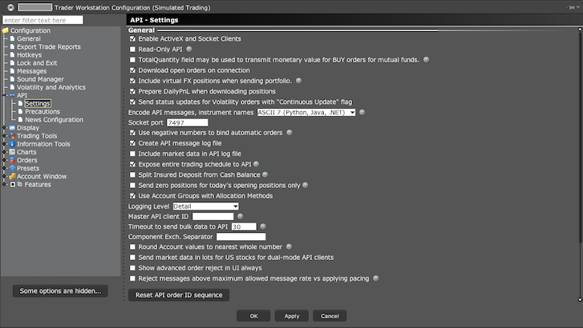
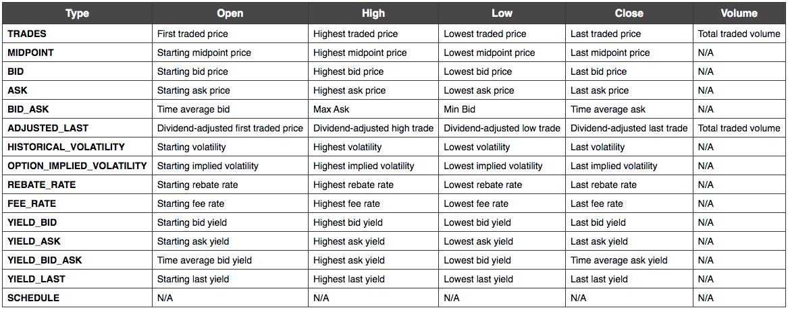
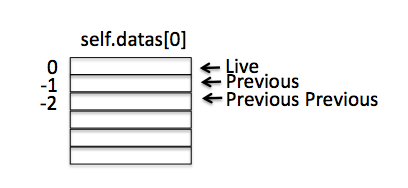
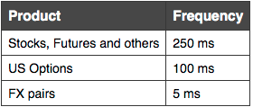
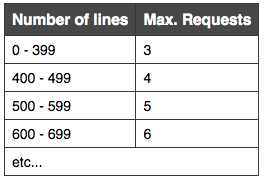
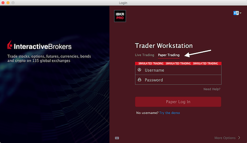
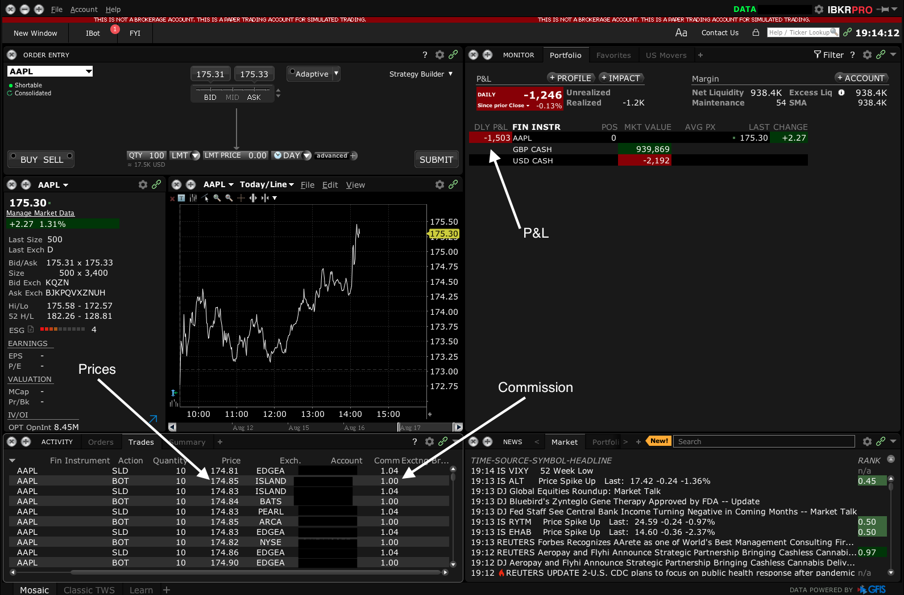
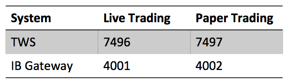

Introduction
============

Currently `backtrader` has a built-in integration for Interactive Brokers (IB) [Trader Workstation API](<http://interactivebrokers.github.io/tws-api/>), but it only works for older versions of the API. 

This project re-worked the orginal integration and created a pluggable version allowing `backtrader` to use the latest IB API.

To start trading follow the steps below:

1.	Open an account with IB 
2.	Download the [IB Python TWS API](https://github.com/InteractiveBrokers/tws-api-public) 
3.	Download the IB client (TWS or IB Gateway) [Trader Workstation Platform](https://www.interactivebrokers.com/en/home.php)
4.	Test for connectivity – Check code sample below

Installation
------------

Create a local python virtual environment:

`python3 -m venv ./env`

Activate the environment, all the following packages will be install in the local ./env directory

`source ./env/bin/activate`

Install backtrader locally (see [Installing Backtrader](https://www.backtrader.com/docu/installation/) for more options)

`pip install backtrader`

Download Interactive Brokers TWS API (from [Trader Workstation API](https://github.com/InteractiveBrokers/tws-api-public))

Select the latest copy, currently it is (twsapi_macunix.1016.01.zip) for Linux

`unzip twsapi_macunix.1016.01.zip`

The file will unzip to the directoty `IBJts`

`cd IBJts/source/pythonclient`

Run the setup.py to install the TWS API.

`python setup.py install`

Download a Atreyu Backtrader API, released version:

`wget https://github.com/atreyuxtrading/atreyu-backtrader-api/archive/refs/tags/v1.0.zip`

Unzip file, and install the Atreyu Backtrader API.

`unzip v1.0.zip`

`cd atreyu-backtrader-api-1.0 ; python setup.py install`

Check Settings of Locally Running TWS
-------------------------------------



Example: Download Realtime Bar Data from TWS
-------------------------------------------

```python
import backtrader as bt
from atreyu_backtrader_api import IBData

cerebro = bt.Cerebro()

data = IBData(host='127.0.0.1', port=7497, clientId=35,
               name="GOOG",     # Data name
               dataname='GOOG', # Symbol name
               secType='STK',   # SecurityType is STOCK 
               exchange='SMART',# Trading exchange IB's SMART exchange 
               currency='USD',  # Currency of SecurityType
               what='BID_ASK',  # Get data fields (see note below)
               rtbar=True,      # Request Realtime bars
               _debug=True      # Set to True to print out debug messagess from IB TWS API
              )

cerebro.adddata(data)
cerebro.run()
```

Create A TestPrinter
--------------------
Note that this is created as a stratgey and will print all the bars that it receives

```python

import backtrader as bt

class TestPrinter(bt.Strategy):

    def log(self, txt, dt=None):
        ''' Logging function for this strategy'''
        dt = dt or self.datas[0].datetime.datetime(0)
        print(f'{dt}, {txt}')

    def __init__(self):
        self.open = self.datas[0].open
        self.high = self.datas[0].high
        self.low = self.datas[0].low
        self.close = self.datas[0].close
        self.volume = self.datas[0].volume
        self.openinterest = self.datas[0].openinterest

    def next(self):
        self.log(f'Open:{self.open[0]:.2f}, \
                   High:{self.high[0]:.2f}, \
                   Low:{self.low[0]:.2f}, \
                   Close:{self.close[0]:.2f}, \
                   Volume:{self.volume[0]:.2f}, \
                   OpenInterest:{self.volume[0]:.2f}' )
        
```

Simple BID_ASK Historical Data
-------------------------------

```python

import backtrader as bt

from atreyu_backtrader_api import IBData
from test_printer import TestPrinter

import datetime as dt

cerebro = bt.Cerebro()

data = IBData(host='127.0.0.1', port=7497, clientId=35,
               name="GOOG",     # Data name
               dataname='GOOG', # Symbol name
               secType='STK',   # SecurityType is STOCK 
               exchange='SMART',# Trading exchange IB's SMART exchange 
               currency='USD',  # Currency of SecurityType
               historical=True,
               what='BID_ASK',  # Update this parameter to select data type
              )

cerebro.adddata(data)

# Add the printer as a strategy
cerebro.addstrategy(TestPrinter)

cerebro.run()

```
Output
------
```
2021-08-09 23:59:59.999986, Open:137.24, High:144.44, Low:136.25, Close:137.55, Volume:-1.00
2021-08-10 23:59:59.999986, Open:138.02, High:139.84, Low:125.00, Close:138.26, Volume:-1.00
2021-08-11 23:59:59.999986, Open:137.54, High:138.95, Low:130.66, Close:137.89, Volume:-1.00
2021-08-12 23:59:59.999986, Open:137.82, High:139.07, Low:130.00, Close:138.12, Volume:-1.00
2021-08-13 23:59:59.999986, Open:138.23, High:139.09, Low:137.78, Close:138.52, Volume:-1.00
2021-08-16 23:59:59.999986, Open:138.04, High:139.90, Low:125.00, Close:138.34, Volume:-1.00
....
2022-08-05 23:59:59.999986, Open:118.06, High:128.00, Low:111.06, Close:118.19, Volume:-1.00
2022-08-07 20:00:00, Open:118.93, High:120.88, Low:113.00, Close:119.02, Volume:-1.00
```

Select Historical Data Types Using "what=" Parameter
-----------------------------------------------------
Historical data is returned in the form of candlesticks, and accessed using the “what=” parameter when requesting data. (see [Interactive Brokers Data Types](https://interactivebrokers.github.io/tws-api/historical_bars.html))


Fetch what=TRADES between 2016/01/01 - 2018/01/01
-------------------------------------------------

```python
import backtrader as bt

from atreyu_backtrader_api import IBData
from test_printer import TestPrinter

import datetime as dt

cerebro = bt.Cerebro()

data = IBData(host='127.0.0.1', port=7497, clientId=35,
               name="GOOG",     # Data name
               dataname='GOOG', # Symbol name
               secType='STK',   # SecurityType is STOCK 
               exchange='SMART',# Trading exchange IB's SMART exchange 
               currency='USD',  # Currency of SecurityType
               fromdate = dt.datetime(2016, 1, 1),
               todate = dt.datetime(2018, 1, 1),
               historical=True,
               what='TRADES',
              )

cerebro.adddata(data)

# Add the printer as a strategy
cerebro.addstrategy(TestPrinter)

cerebro.run()
```

Output
------
```
2016-01-05 00:00:00, Open:37.38, High:37.38, Low:36.56, Close:37.10, Volume:460493.60
2016-01-06 00:00:00, Open:37.00, High:37.60, Low:36.93, Close:37.15, Volume:272008.00
2016-01-07 00:00:00, Open:36.87, High:37.36, Low:36.25, Close:37.30, Volume:276044.20
2016-01-08 00:00:00, Open:36.17, High:36.92, Low:35.95, Close:36.50, Volume:425276.00
...
2017-12-27 00:00:00, Open:52.86, High:53.00, Low:52.51, Close:52.70, Volume:70263.00
2017-12-28 00:00:00, Open:52.90, High:52.92, Low:52.40, Close:52.46, Volume:151108.40
2017-12-29 00:00:00, Open:52.66, High:52.74, Low:52.24, Close:52.36, Volume:105796.60
2017-12-30 00:00:00, Open:52.42, High:52.55, Low:52.13, Close:52.24, Volume:75590.60
```

How is the Data Presented in the Strategy?
------------------------------------------
The data retrieved from IB is presented in the strategy as the variable self.datas[0].

The latest close price is available at index 0, and progressively earlier prices are stored using a negative index. (See diagram below)



```python
import backtrader as bt

# Create a Stratey
class TestStrategy(bt.Strategy):

    def log(self, txt, ts=None):
        ''' Logging function for this strategy'''
        ts = ts or self.datas[0].datetime.datetime(0)
        print(f'{ts}, {txt}')

    def __init__(self):
        self.close = self.datas[0].close

    def next(self):
        # Current close
        self.log(f'Close:{self.close[0]:.2f}' )
        if self.close[0] < self.close[-1]:
             # current close less than previous close, think about buying
             if self.close[-1] < self.close[-2]:
                # previous close less than previous close, so buy
                self.log('BUY CREATE, %.2f' % self.close[0])
                self.buy()
```

Using IB Historical Data to Drive a Strategy with "what=MIDPOINT"
---------------------------------------------------------------

```python
import backtrader as bt

from atreyu_backtrader_api import IBData
from test_strategy import TestStrategy

import datetime as dt

cerebro = bt.Cerebro()

data = IBData(host='127.0.0.1', port=7497, clientId=35,
               name="GOOG",     # Data name
               dataname='GOOG', # Symbol name
               secType='STK',   # SecurityType is STOCK 
               exchange='SMART',# Trading exchange IB's SMART exchange 
               currency='USD',  # Currency of SecurityType
               fromdate = dt.datetime(2016, 1, 1),
               todate = dt.datetime(2018, 1, 1),
               historical=True,
               what='MIDPOINT',
              )

cerebro.adddata(data)

# Add the test strategy
cerebro.addstrategy(TestStrategy)

# Set our desired cash start
cerebro.broker.setcash(100000.0)

cerebro.run()

print('Final Portfolio Value: %.2f' % cerebro.broker.getvalue())
```

Naming Datasources and using them in a Strategy
-----------------------------------------------
Datasources can be given logical datanames (i.e. based on the "what" parameter), the logical name can then be accessed using the \_name variable.
In the strategy below the logical name is stored in the self.name0 and self.name1 variables, and can be used to identify the buy for each symbol.

```python
import backtrader as bt

# Create a Stratey
class TestStrategy(bt.Strategy):

    def log(self, txt, ts=None):
        ''' Logging function for this strategy'''
        ts = ts or self.datas[0].datetime.datetime(0)
        print(f'{ts}, {txt}')

    def __init__(self):
        self.close0 = self.datas[0].close
        self.name0 = self.datas[0]._name

        self.close1 = self.datas[1].close
        self.name1 = self.datas[1]._name

    def next(self):
        # Current close dataset0
        self.log(f'{self.name0} Close:{self.close0[0]:.2f}' )
        if self.close0[0] < self.close0[-1]:
             # current close less than previous close, think about buying
             if self.close0[-1] < self.close0[-2]:
                # previous close less than previous close, so buy
                self.log(f"BUY {self.name0} @ {self.close0[0]:.2f}")
                self.buy()

        # Current close dataset1
        self.log(f'{self.name1} Close:{self.close1[0]:.2f}' )
        if self.close1[0] < self.close1[-1]:
             # current close less than previous close, think about buying
             if self.close1[-1] < self.close1[-2]:
                # previous close less than previous close, so buy
                self.log(f"BUY {self.name1} @ {self.close1[0]:.2f}")
                self.buy()
```
See the name parameter being used to tag each datasource in the example below:

```python

import backtrader as bt

from atreyu_backtrader_api import IBData
from test_strategy import TestStrategy

import datetime as dt

cerebro = bt.Cerebro()

goog_data = IBData(host='127.0.0.1', port=7497, clientId=35,
               name="GOOG_TRADES",  # Data name
               dataname='GOOG',     # Symbol name
               secType='STK',       # SecurityType is STOCK 
               exchange='SMART',    # Trading exchange IB's SMART exchange 
               currency='USD',      # Currency of SecurityType
               fromdate = dt.datetime(2016, 1, 1),
               todate = dt.datetime(2018, 1, 1),
               historical=True,
               what='TRADES',
              )

cerebro.adddata(goog_data)

apple_data = IBData(host='127.0.0.1', port=7497, clientId=35,
               name="AAPL_MIDPOINT",# Data name
               dataname='AAPL',     # Symbol name
               secType='STK',       # SecurityType is STOCK 
               exchange='SMART',    # Trading exchange IB's SMART exchange 
               currency='USD',      # Currency of SecurityType
               fromdate = dt.datetime(2016, 1, 1),
               todate = dt.datetime(2018, 1, 1),
               historical=True,
               what='MIDPOINT',
              )

cerebro.adddata(apple_data)

# Add the test strategy
cerebro.addstrategy(TestStrategy)

# Set our desired cash start
cerebro.broker.setcash(100000.0)

cerebro.run()

print('Final Portfolio Value: %.2f' % cerebro.broker.getvalue())

```

Output
------

```
2016-01-05 00:00:00, AAPL_MIDPOINT Close:26.43
2016-01-05 00:00:00, BUY AAPL_MIDPOINT @ 26.43
2016-01-05 00:00:00, GOOG_TRADES Close:37.10
2016-01-05 00:00:00, BUY GOOG_TRADES @ 37.10
...
2017-12-29 00:00:00, AAPL_MIDPOINT Close:42.71
2017-12-30 00:00:00, GOOG_TRADES Close:52.24
2017-12-30 00:00:00, BUY GOOG_TRADES @ 52.24
2017-12-30 00:00:00, AAPL_MIDPOINT Close:42.27
Final Portfolio Value: 102168.92
```

5-Second Real-time Bars from IB
-------------------------------
Real-time bars represent a price performance for a specific period. These periods could be as long as a day or as short as a second, depending on the purpose for which the bar is to be used. Daily bars are usually the most popular for analysis whereas shorter duration bars can be used for trading.

In the case of IB the TWS API can be used to fetch 5-second duration bar. 
The example below creates an active subscription that will return a single bar in real time every five seconds that has the OHLC values over that period. Additionally we are switching off the backfill of data from initial start to reconnect in case of connection disruption.

```python

import backtrader as bt

from atreyu_backtrader_api import IBData
from test_printer import TestPrinter

import datetime as dt
from datetime import datetime, date, time

cerebro = bt.Cerebro()

data = IBData(host='127.0.0.1', port=7497, clientId=35,
               name="AAPL",  # Data name
               dataname='AAPL',     # Symbol name
               secType='STK',       # SecurityType is STOCK 
               exchange='SMART',    # Trading exchange IB's SMART exchange 
               currency='USD',      # Currency of SecurityType
               backfill_start=False,
               backfill=False,
               what='TRADES', # TRADES or MIDPOINT
               rtbar=True
              )

cerebro.adddata(data)

# Add the test strategy
cerebro.addstrategy(TestPrinter)

cerebro.run()


```
Output
------
```
2022-08-11 15:22:20, Symbol: AAPL Open:169.29, High:169.29, Low:169.28, Close:169.29, Volume:101.13
2022-08-11 15:22:25, Symbol: AAPL Open:169.29, High:169.29, Low:169.25, Close:169.26, Volume:79.5
2022-08-11 15:22:30, Symbol: AAPL Open:169.27, High:169.30, Low:169.23, Close:169.23, Volume:57.5
2022-08-11 15:22:35, Symbol: AAPL Open:169.23, High:169.30, Low:169.22, Close:169.27, Volume:89.72
```

Top Of Book Market Data (Level I)
---------------------------------
Using the TWS API, real time market data can also be requested for trading and analysis. This data is not tick-by-tick but consists of aggregated snapshots taken at intra-second intervals which differ depending on the type of instrument:



We select non-bar data by setting rtbar=False, note that the data will still be presented in the OHLCV format for use in the strategy.

```python
import backtrader as bt

from atreyu_backtrader_api import IBData
from test_printer import TestPrinter

import datetime as dt
from datetime import datetime, date, time

cerebro = bt.Cerebro()

data = IBData(host='127.0.0.1', port=7497, clientId=35,
               name="AAPL",  # Data name
               dataname='AAPL',     # Symbol name
               secType='STK',       # SecurityType is STOCK 
               exchange='SMART',    # Trading exchange IB's SMART exchange 
               currency='USD',      # Currency of SecurityType
               backfill_start=False,
               backfill=False,
               rtbar=False
              )

cerebro.adddata(data)

# Add the test strategy
cerebro.addstrategy(TestPrinter)

cerebro.run()
```
Ouput
-----
```
2022-08-11 16:36:11.410065, Symbol: AAPL Open:169.70, High:169.70, Low:169.70, Close:169.70, Volume:2200.0
2022-08-11 16:36:11.410105, Symbol: AAPL Open:169.70, High:169.70, Low:169.70, Close:169.70, Volume:100.0
2022-08-11 16:36:11.410156, Symbol: AAPL Open:169.70, High:169.70, Low:169.70, Close:169.70, Volume:100.0
2022-08-11 16:36:11.410196, Symbol: AAPL Open:169.70, High:169.70, Low:169.70, Close:169.70, Volume:253852.0
2022-08-11 16:36:11.411061, Symbol: AAPL Open:169.69, High:169.69, Low:169.69, Close:169.69, Volume:253852.0
2022-08-11 16:36:11.411081, Symbol: AAPL Open:169.69, High:169.69, Low:169.69, Close:169.69, Volume:1900.0
2022-08-11 16:36:11.411141, Symbol: AAPL Open:169.71, High:169.71, Low:169.71, Close:169.71, Volume:1900.0
2022-08-11 16:36:11.411161, Symbol: AAPL Open:169.71, High:169.71, Low:169.71, Close:169.71, Volume:2900.0
```

Real-time Tick by Tick Data
---------------------------
In addition to the aggregated tick snapshots, IB also has true tick-by-tick data, but it comes with some limitations. Tick-by-tick data corresponds to the data shown in the TWS Time & Sales. The maximum number of simultaneous tick-by-tick subscriptions allowed for a user is determined by the limitations below.

Limitations - Additional symbol request can be purchased through a quote booster pack, each quote booster pack provides a 100 market data lines. There is a limit of 10 quote boosters packs per account and rest of the market data lines are allocated using equity and commissions.



The “what=” must be set to the following BID_ASK (BidAsk), TRADES (Last), TRADES_ALL (AllLast), MIDPOINT (MidPoint), the default is TRADES if “what” is not set. TRADES_ALL has additional trade types such as combos, derivatives, and average price trades that are not included in TRADES.
Note in the example below “timeframe=bt.TimeFrame.Ticks” to select the tick-by-tick IB function.

```python
import backtrader as bt

from atreyu_backtrader_api import IBData
from test_printer import TestPrinter

import datetime as dt
from datetime import datetime, date, time

cerebro = bt.Cerebro()

data = IBData(host='127.0.0.1', port=7497, clientId=35,
               name="AAPL",  # Data name
               dataname='AAPL',     # Symbol name
               secType='STK',       # SecurityType is STOCK 
               exchange='SMART',    # Trading exchange IB's SMART exchange 
               currency='USD',      # Currency of SecurityType
               timeframe=bt.TimeFrame.Ticks,
               what='BID_ASK',      # TRADES, TRADES_ALL, MID_POINT
               rtbar=False
              )

cerebro.adddata(data)

# Add the test strategy
cerebro.addstrategy(TestPrinter)

cerebro.run()
```

Output
------
```
2022-08-11 17:29:22, Symbol: AAPL Open:nan, High:nan, Low:nan, Close:169.41, Volume:260.0
2022-08-11 17:29:22, Symbol: AAPL Open:nan, High:nan, Low:nan, Close:169.41, Volume:100.0
2022-08-11 17:29:22, Symbol: AAPL Open:nan, High:nan, Low:nan, Close:169.41, Volume:100.0
...
2022-08-11 17:29:22, Symbol: AAPL Open:nan, High:nan, Low:nan, Close:169.41, Volume:100.0
2022-08-11 17:29:22, Symbol: AAPL Open:nan, High:nan, Low:nan, Close:169.41, Volume:100.0
2022-08-11 17:29:22, Symbol: AAPL Open:nan, High:nan, Low:nan, Close:169.41, Volume:100.0
```

From Back Test to Paper Trading
-------------------------------
In this section we look at the steps in developing a simple strategy and back testing it with historical data from IB. Then modifying it to Paper Trader in the TWS frontend.

An Example of a Simple Buy/Sell Strategy - Not that in this strategy we generate Buy and Sell market orders related to a simple moving average calculation. This strategy has been adapted from (https://www.backtrader.com/docu/quickstart/quickstart) with minor updates.

```python
import backtrader as bt

# Create a Stratey
class TestStrategy(bt.Strategy):
    params = (
        ('ma_period', 15),
    )

    def log(self, txt, ts=None):
        ''' Logging function for this strategy'''
        ts = ts or self.datas[0].datetime.datetime(0)
        print(f'{ts}, {txt}')

    def __init__(self):
        # Keep a reference to the "close" line in the data[0] dataseries
        self.dataclose = self.datas[0].close

        # To keep track of pending orders and buy price/commission
        self.order = None
        self.buyprice = None
        self.buycomm = None

        # Add a MovingAverageSimple indicator
        self.sma = bt.indicators.SimpleMovingAverage(self.datas[0], period=self.params.ma_period)

    def notify_order(self, order):
        if order.status in [order.Submitted, order.Accepted]:
            # Buy/Sell order submitted/accepted to/by broker - Nothing to do
            return

        # Check if an order has been completed
        # Attention: broker could reject order if not enough cash
        if order.status in [order.Completed]:
            if order.isbuy():
                self.log(
                    f'BUY EXECUTED, Price: {order.executed.price:.2f}, Cost: {order.executed.value:.2f}, Comm: {order.executed.comm:.2f}')

                self.buyprice = order.executed.price
                self.buycomm = order.executed.comm
            else:  # Sell
                self.log(f'SELL EXECUTED, Price: {order.executed.price:.2f}, Cost: {order.executed.value:.2f}, Comm: {order.executed.comm:.2f}')

            self.bar_executed = len(self)

        elif order.status in [order.Canceled, order.Margin, order.Rejected]:
            self.log('Order Canceled/Margin/Rejected')

        self.order = None

    def notify_trade(self, trade):
        if not trade.isclosed:
            return

        self.log(f'OPERATION PROFIT, GROSS: {trade.pnl:.2f}, NET: {trade.pnlcomm:.2f}')

    def next(self):
        # Simply log the closing price of the series from the reference
        self.log(f'Close, {self.dataclose[0]:.2f}')

        # Check if an order is pending ... if yes, we cannot send a 2nd one
        if self.order:
            return

        # Check if we are in the market
        if not self.position:
            # Not yet ... we MIGHT BUY if ...
            if self.dataclose[0] > self.sma[0]:

                # BUY, BUY, BUY!!! (with all possible default parameters)
                self.log(f'BUY CREATE  @MKT: {self.dataclose[0]:.2f}')

                # Keep track of the created order to avoid a 2nd order
                self.order = self.buy()
                self.log(f'BUY CREATED Size: {self.order.size} @ MKT')

        else:
            if self.dataclose[0] < self.sma[0]:
                # SELL, SELL, SELL!!! (with all possible default parameters)
                self.log(f'SELL CREATE @ MKT: {self.dataclose[0]:.2f}')

                # Keep track of the created order to avoid a 2nd order
                self.order = self.sell()
                self.log(f'SELL CREATED Size: {self.order.size} @ MKT')
```

Back Testing The Strategy Using IB Historical Data
--------------------------------------------------

```python
import backtrader as bt

from atreyu_backtrader_api import IBData
from test_strategy import TestStrategy

import datetime as dt
from datetime import datetime, date, time

cerebro = bt.Cerebro()

data = IBData(host='127.0.0.1', port=7497, clientId=35,
               name="AAPL",         # Data name
               dataname='AAPL',     # Symbol name
               secType='STK',       # SecurityType is STOCK
               exchange='SMART',    # Trading exchange IB's SMART exchange 
               currency='USD',      # Currency of SecurityType
               historical=True
              )

cerebro.adddata(data)

# Set our desired cash start
cerebro.broker.setcash(100000.0)

# Add the test strategy
cerebro.addstrategy(TestStrategy)

# Add a FixedSize sizer according to the stake
cerebro.addsizer(bt.sizers.FixedSize, stake=10)

cerebro.run()

# Print out the final result
print(f'Final Portfolio Value: {cerebro.broker.getvalue():.2f}')
```
Output
------
```
2021-09-01 23:59:59.999989, Close, 153.16
2021-09-01 23:59:59.999989, BUY CREATE  @MKT: 153.16
2021-09-01 23:59:59.999989, BUY CREATED Size: 10 @ MKT
2021-09-02 23:59:59.999989, BUY EXECUTED, Price: 152.86, Cost: 1528.60, Comm: 0.00
2021-09-02 23:59:59.999989, Close, 153.59
2021-09-03 23:59:59.999989, Close, 154.29
2021-09-07 23:59:59.999989, Close, 156.76
2021-09-08 23:59:59.999989, Close, 155.00
2021-09-09 23:59:59.999989, Close, 154.27
2021-09-10 23:59:59.999989, Close, 148.67
2021-09-10 23:59:59.999989, SELL CREATE @ MKT: 148.67
2021-09-10 23:59:59.999989, SELL CREATED Size: -10 @ MKT
2021-09-13 23:59:59.999989, SELL EXECUTED, Price: 149.70, Cost: 1528.60, Comm: 0.00
2021-09-13 23:59:59.999989, OPERATION PROFIT, GROSS: -31.60, NET: -31.60
2021-09-13 23:59:59.999989, Close, 149.53
2021-09-14 23:59:59.999989, Close, 148.19
...
2022-08-08 23:59:59.999989, Close, 165.27
2022-08-09 23:59:59.999989, Close, 165.01
2022-08-10 23:59:59.999989, Close, 169.10
2022-08-11 00:00:00, Close, 168.89
Final Portfolio Value: 100409.00
```

Paper Trading on IB
-------------------
Once a strategy has been back tested for basic operation it should be paper traded i.e. where simulated trades are generated and marked using live data to gain confidence in your overall trading strategy and goal.

Be careful to login to TWS using the Paper Trading option (see arrow):


In addition to selecting “Paper Trading” the execution of the strategy also needs to be changed to use IB as the broker to place orders and update positions.

```python
import backtrader as bt

from atreyu_backtrader_api import IBData
from atreyu_backtrader_api import IBStore

from test_strategy import TestStrategy

import datetime as dt
from datetime import datetime, date, time

cerebro = bt.Cerebro()

ibstore = IBStore(host='127.0.0.1', 
                  port=7497, 
                  clientId=35)

data = ibstore.getdata(name="AAPL",         # Data name
                       dataname='AAPL',     # Symbol name
                       secType='STK',       # SecurityType is STOCK
                       exchange='SMART',    # Trading exchange IB's SMART exchange 
                       currency='USD'      # Currency of SecurityType
                       )

cerebro.adddata(data)

broker = ibstore.getbroker()

# Set the broker
cerebro.setbroker(broker)

# Add the test strategy
cerebro.addstrategy(TestStrategy)

# Add a FixedSize sizer according to the stake
cerebro.addsizer(bt.sizers.FixedSize, stake=10)

cerebro.run()
```

Output
------
```
...
2022-08-17 19:06:33.352691, Close, 174.84
2022-08-17 19:06:33.352741, Close, 174.84
2022-08-17 19:06:33.352781, Close, 174.84
2022-08-17 19:06:33.601432, SELL EXECUTED, Price: 174.83, Cost: 1749.40, Comm: 1.04
2022-08-17 19:06:33.601432, OPERATION PROFIT, GROSS: -0.10, NET: -2.14
2022-08-17 19:06:33.601432, Close, 174.83
2022-08-17 19:06:33.601462, Close, 174.83
2022-08-17 19:06:33.601522, Close, 174.85
2022-08-17 19:06:33.601522, BUY CREATE  @MKT: 174.85
2022-08-17 19:06:33.601522, BUY CREATED Size: 10 @ MKT
2022-08-17 19:06:33.601533, Close, 174.85
...
```

Once the strategy is initiated the orders start appearing in TWS
----------------------------------------------------------------



From Paper Trading To Real Trading – Monitoring, Debug and Go Live!
-------------------------------------------------------------------
Paper trading can help to validate the efficacy of a strategy, so it is prudent to continue paper trading until a stable performance and profitability profile has been achieved.

Sometimes successful paper trading strategies may not translate to the same performance in real trading. This can be for a myriad of reasons from external factors (market impact, price slippage, market microstructure etc.) to simple programming issues.

To help isolate and identify these issues it is important to have a robust monitoring and debugging facilities built into the trading process.

The simplest and most effective function is having accurate logging that records not only the trades but identifies the assets, opening and closing prices and trigger conditions and parameters pertinent to the strategy. Additionally the Backtrader and TWS API also has debugging built and can be accessed by setting the appropriate configuration parameters.



An Example of a Simple Buy/Sell Strategy With Logging
-----------------------------------------------------
```python
import backtrader as bt

import logging
# Generate file level logger
logger = logging.getLogger(__name__)

# Create a Stratey
class TestStrategy(bt.Strategy):
    params = (
        ('ma_period', 15),
    )

    def log(self, txt, ts=None):
        ''' Logging function for this strategy'''
        # Add log statement
        logger.info(f'{txt}')
        ...
        
```

Setting Up A Log File
---------------------
There is a example custom logger supplied in the atreyu_backtrader_api module, and can be referenced in the code as follows:

```python
import logging
from atreyu_backtrader_api.custom_logger import setup_custom_logger
```
The logger has the following properties:
-	It can write a named log file into a named directory thereby keeping all the logs together.
-	It has log rotation, e.g. it does not overwrite logs on repeated restarts but backs each log keeping the specified logfile as the latest log.
-	Each log line can be echoed to the terminal as well as written to the logfile  

The logger can be setup as follows:
```python
LOGGING_DEBUG = False
logger = setup_custom_logger(global_name = 'root',
                              debug_level = logging.DEBUG if LOGGING_DEBUG else logging.INFO,
                              filename    = "sma_strategy.log", # Set the log file name
                              logdirname  = './logs',           # and the directory for the logs
                              console     = True)               # Echo the log line to the terminal

```
Configuring each sub-logger for the module and source file that is of interest, can control the logfile output.
```python
LOGGING_DEBUG = False
logger = setup_custom_logger(global_name = 'root',
                              debug_level = logging.DEBUG if LOGGING_DEBUG else logging.INFO,
                              filename    = "sma_strategy.log", # Set the log file name
                              logdirname  = './logs',           # and the directory for the logs
                              console     = True)               # Echo the log line to the terminal

# Log configuration for Atreyu Back Trader API module
logging.getLogger('atreyu_backtrader_api').setLevel(logging.ERROR)
# logging.getLogger('atreyu_backtrader_api.ibbroker').setLevel(logging.INFO)
# logging.getLogger('atreyu_backtrader_api.ibdata').setLevel(logging.INFO)
# logging.getLogger('atreyu_backtrader_api.ibstore').setLevel(logging.INFO)

# Log configuration for IB API module
logging.getLogger('ibapi').setLevel(logging.ERROR)
# logging.getLogger('ibapi.decoder').setLevel(logging.ERROR)
# logging.getLogger('ibapi.utils').setLevel(logging.ERROR)
# logging.getLogger('ibapi.client').setLevel(logging.ERROR)
#logging.getLogger('ibapi.decoder').setLevel(logging.DEBUG)
```

Enable Logging in Backtrader
To enable logging in the Backtrader framework the _debug = True variable can be passed when setting up the IBStore and IBData classes.
```python
PAPER_TRADING_PORT = 7497
LIVE_TRADING_PORT = 7496

cerebro = bt.Cerebro()
HOST = '127.0.0.1'
PORT = PAPER_TRADING_PORT
logger.info(f"Starting host: {HOST} port: {PORT}")
ibstore = IBStore(host=HOST, 
                  port=PORT, 
                  clientId=35,
                  _debug = True)

data = ibstore.getdata(name="AAPL",         # Data name
                       dataname='AAPL',     # Symbol name
                       secType='STK',       # SecurityType is STOCK
                       exchange='SMART',    # Trading exchange IB's SMART exchange 
                       currency='USD',       # Currency of SecurityType
                       _debug = True
                       )

cerebro.adddata(data)

broker = ibstore.getbroker()

# Set the broker
cerebro.setbroker(broker)
```
Output
------
```
Calling updateAccountTime('20:10')
Calling tickSize(16777217, 8, Decimal('361198'))
Calling tickString(16777217, 45, '1661454621')
Calling tickString(16777217, 84, 'Z')
Calling tickPrice(16777217, 4, 169.19, 4361192208: CanAutoExecute: 0, PastLimit: 0, PreOpen: 0)
Calling tickSize(16777217, 5, Decimal('100'))
Calling tickSize(16777217, 5, Decimal('100'))
Calling tickPrice(16777217, 1, 169.18, 4361192208: CanAutoExecute: 1, PastLimit: 0, PreOpen: 0)
Calling tickSize(16777217, 0, Decimal('1600'))
Calling get_acc_cash()
Calling tickPrice(16777217, 2, 169.19, 4361192448: CanAutoExecute: 1, PastLimit: 0, PreOpen: 0)
Calling get_acc_value()
Calling tickSize(16777217, 3, Decimal('1500'))
Calling get_acc_value()
Calling tickSize(16777217, 0, Decimal('1600'))
Calling tickSize(16777217, 3, Decimal('1500'))
Calling tickString(16777217, 32, 'PQXZUH')
Calling tickString(16777217, 33, 'KPQZNUH')
```
Onward To Live Trading
----------------------
Now that you have implemented logging, and have and good understanding of how to debug your strategy you are ready to go live.

It is suggested that trading starts small, and that as confidence is gained trading sizes/frequency is increased within your prescribed risk appetite. At each stage it is recommended that you review the logs for anomalies that you may not notice from looking at the TWS screens.

Switching the strategy to live trading is as simple as logging in with TWS for trading and changing the port designator in the code below:

```python
PAPER_TRADING_PORT = 7497
LIVE_TRADING_PORT = 7496

cerebro = bt.Cerebro()
HOST = '127.0.0.1'
PORT = LIVE_TRADING_PORT
logger.info(f"Starting host: {HOST} port: {PORT}")
ibstore = IBStore(host=HOST, 
                  port=PORT, 
                  clientId=35,
                  _debug = True)

data = ibstore.getdata(name="AAPL",         # Data name
                       dataname='AAPL',     # Symbol name
                       secType='STK',       # SecurityType is STOCK
                       exchange='SMART',    # Trading exchange IB's SMART exchange 
                       currency='USD',       # Currency of SecurityType
                       _debug = True
                       )

cerebro.adddata(data)

broker = ibstore.getbroker()

# Set the broker
cerebro.setbroker(broker)
```

Disclaimer
----------
The software is provided on the conditions of the simplified BSD license.

This project is not affiliated with Interactive Brokers Group, Inc.

